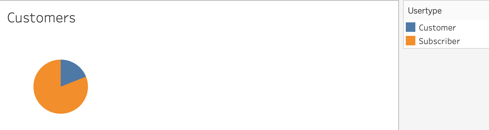
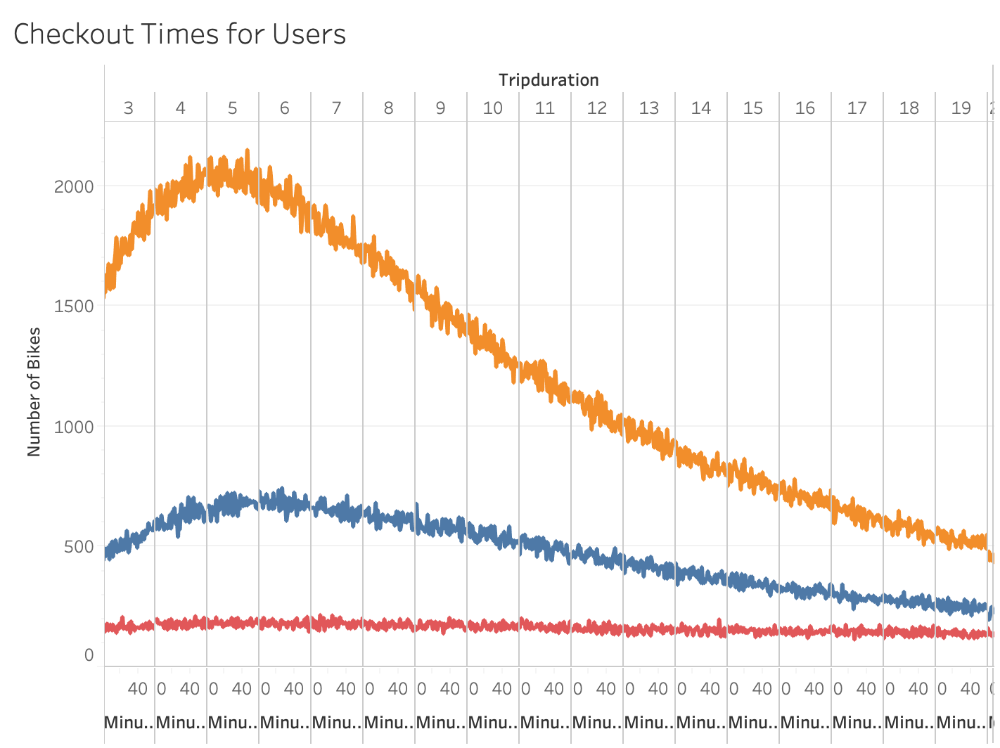
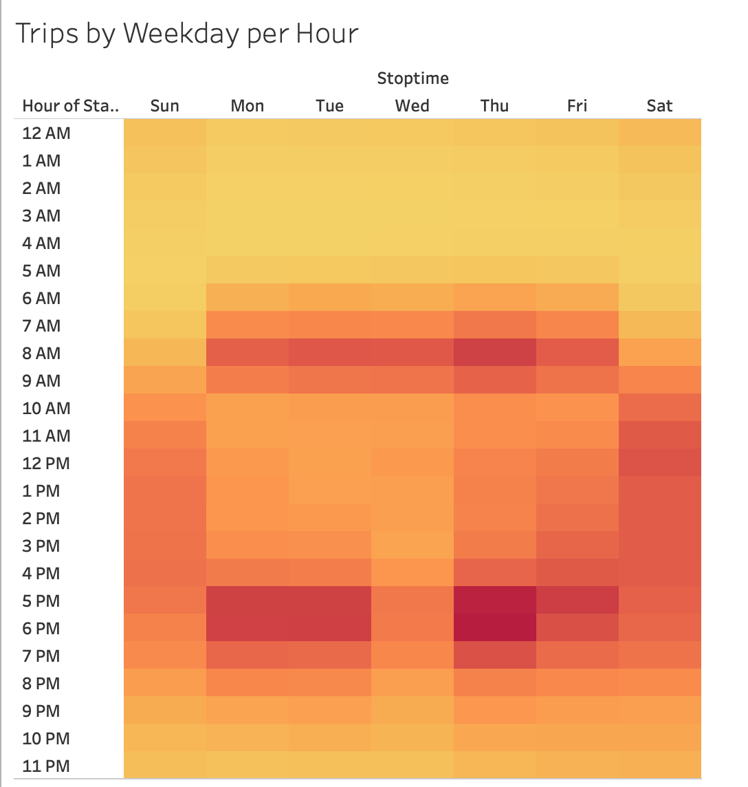
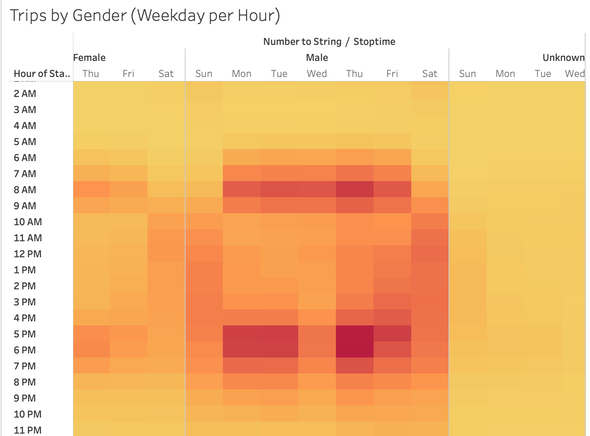
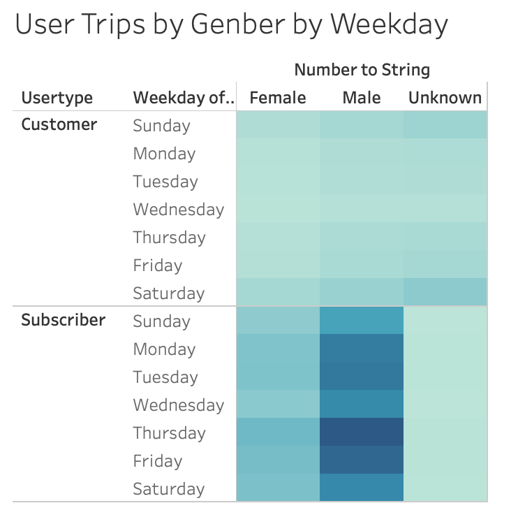

# bikesharing
## Overview of the analysis
The purpose of this analysis is to better understand NYC Citi Bike data. For this analysis, Citi Bike data was used in Tableau, a visualization software to break down the data and analyze trends in a form that many people can understand. From this analysis, we will determine if a similar service will be profitable in other cities.

## Results

#### Customer Breakdown

The visualization above was created to understand people who utilize Citi Bike services. From the data above it can be seen clearly that over 75% of people utilizing Citi Bike services are subscribers, while less than 25% are customers.

#### Gender Breakdown

From the customers who use Citi Bike services above is a breakdown of their gender. It can be seen that over 60% of customers are males, about 25% are females, and about 15% are unknown.

#### Checkout Times for Users

The visualization above shows that peak checkout time for both males and females is 5 while unknowns do not have a peak checkout time.

#### Trips by Weekday per Hour

The data above shows that most activity happens between 7 AM - 9 AM and 4 PM - 7 PM throughout the week. That being said it's important to note that the busiest time and day is Thursday afternoons. 

#### Trip by Gender(Weekday per Hour)

From the data above it can be seen that males are the most active members during the busiest times. Thursday afternoon rides are the highest for them, while females are fairly constant with no obvious busy times. Unknowns are similar to females, they have no obvious busy time throughout the week.

#### User Trips by Gender by Weekday

Male subscribers are the overall most active community throughout the weekdays, with Thursday being their most active day. Female subscribers and unknown subscribers have no clear preferred day. Furthermore, for all three customer genders, there is no preferred day on the weekday, all weekdays look similar for the three genders.

#### Tableau Story
[Link to my Story](https://public.tableau.com/profile/noel.luna3290#!/vizhome/Module14Challenge_16113768033450/Story1?publish=yes)

## Summary

Tableau visualizations were useful to help understand trends and analyzing the Citi Bike data. The above visualizations show that majority of people using Citi Bike services are male subscribers. Most bikes are being checkout after 9 AM with peaks of weekday activity between 7 AM - 9 AM and 4 PM - 7 PM. When this data is broken down by gender, male subscribers are using Citi Bike services during peak weekday activity and males subscribers show the most activity during Thursday afternoons. Females and unknowns have similar weekday activity and they do not have a specific time and day to be active.

Two additional visualizations that would be useful to determine if a similar service could be profitable in other cities would be an age visualization by gender and popular end station. An age visualization by gender would be useful to better understand the targeted city community. For example, the data above shows that males are the most active gender but we do not know their age. Let's assume they are young males who use Citi Bike services. However, the possible candidate city to open similar Citi Bike services has an older population of males. Opening a similar Citi Bike service where the male population is much older would not be a smart decision based on the data and that could cost the business to fail. Also, a visualization with a popular end station would be useful to understand why Citi Bike users use their services. NYC is a dense city with many tourist attractions and shopping centers. Better understanding why Citi Bike users use their services is very valuable information. For example, let's say over 70% of NYC Citi Bike users use Citi Bike to visit tourist attractions. That being said, the candidate city has no tourist attractions or tourist for that matter. Opening a similar service in a city that has little to no tourist or tourist attractions would not be a smart decision based on the data from NYC Citi Bike.
