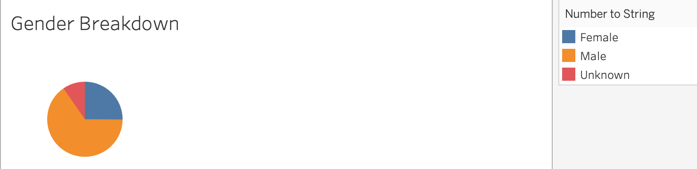

# bikesharing
## Over view of the analysis
The purpose of this analysis is to better understand NYC citibike data. For this analysis citibike data was used in Tableau, a visulization software to break down the data and analyse trends in a form that many people can understand visualizations. From this analysis we will determine if a similar service will be profitable in other cities.

## Results

#### Customer Breakdown

The visualization above was created to understand people who utilize citibike services. From the data above it can be seen clearly that over 75% of people utilizing citibike services are subscribers, while less that 25% are customers.

#### Gender Breakdown

From the customers who use citibike services above a breakdown of their gender. From the data above it can be seen that over 60% of customers are males, about 25% are females, and about 15% are unknown.

#### Checkout Times for Users

The visualization above it can be seen that around 5AM most bikes are available for all 3 genders. After 9AM the amount bikes available start decline for males and females. While unknown have a constant line throught the hours, there are no major peaks or declines in checkout times for unknowns.

#### Trips by Weekday per Hour

The data above shows that most activity happens between 7AM - 9AM and 4PM - 7PM throughout the week. That being said its important to note that the busiest time and day is Thursday afternoons. 

#### Trip by Gender(Weekday per Hour)

From the data above it can be seen that males are the most active 

#### Trips by Gender by Weekday

#### Tableau Story
[Link to my Story](https://public.tableau.com/profile/noel.luna3290#!/vizhome/Module14Challenge_16113768033450/Story1?publish=yes)

## Summary
Summary: Provide a high-level summary of the results and two additional visualizations that you would perform with the given dataset.
